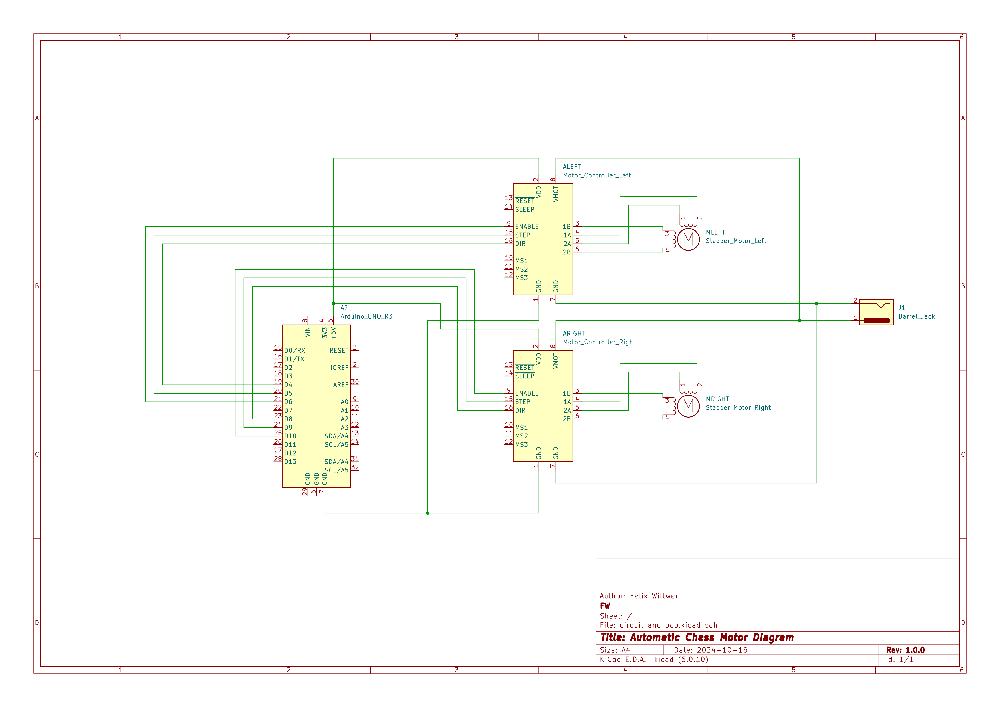

# automatic_chess

## grbl firmware v1.1 for movement

[https://github.com/gnea/grbl](https://github.com/gnea/grbl)

Follow the original guide for installation and compilation: [https://github.com/gnea/grbl/wiki/Compiling-Grbl](https://github.com/gnea/grbl/wiki/Compiling-Grbl)

Instead of the original Repository the cusomt configuration in this repository should be used.

##

[Diagram in PDF form](./circuit_diagrams/Motor_Diagram.pdf)